# 逐飞科技LS2K300\LS2K301核心板刷系统教程

## 1、下载相关软件以及系统

通过网盘分享的文件：龙芯 2k301 U盘刷系统固件以及软件

链接: https://pan.baidu.com/s/1JKB3DUq0UkBPr1bfuf-y8g?pwd=nw9f 提取码: nw9f

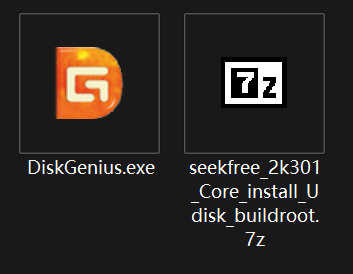

<DiskGenius.exe>这个软件是磁盘格式化软件，我们后续需要用这个软件将U盘格式化为EXT4格式。

seekfree_2k301_Core_install_Udisk_buildroot.7z为系统镜像，放入EXT4格式的U盘根目录即可。

## 2、制作刷系统的U盘

插入U盘到PC端，并且打开DiskGenius程序。

### 2.1、打开DiskGeniu.exe

DiskGenius 这个软件打开可能有点慢，需要耐心等待一下。

### 2.2、格式化U盘位EXT4格式

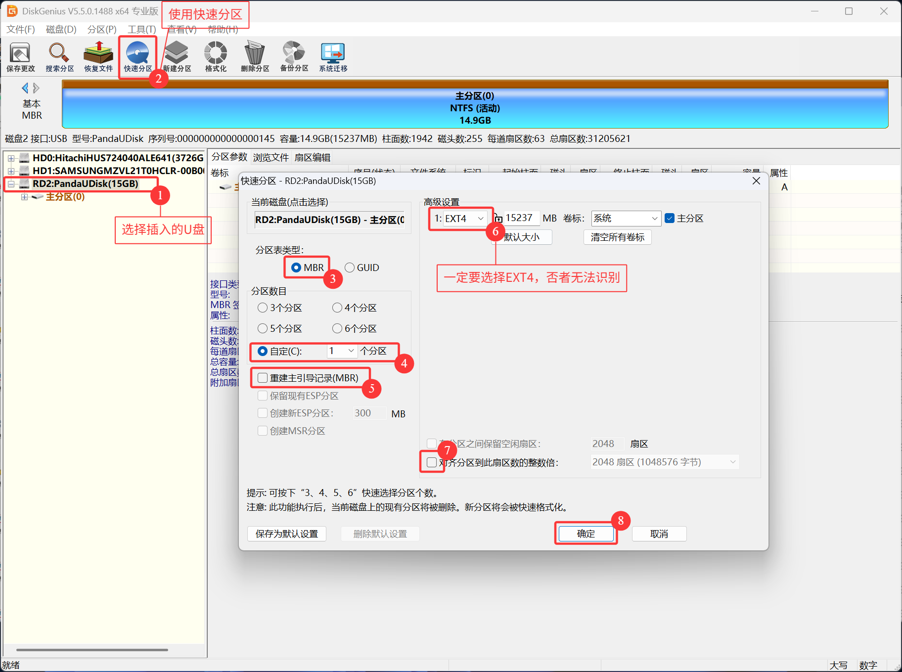

点击确认后，等待

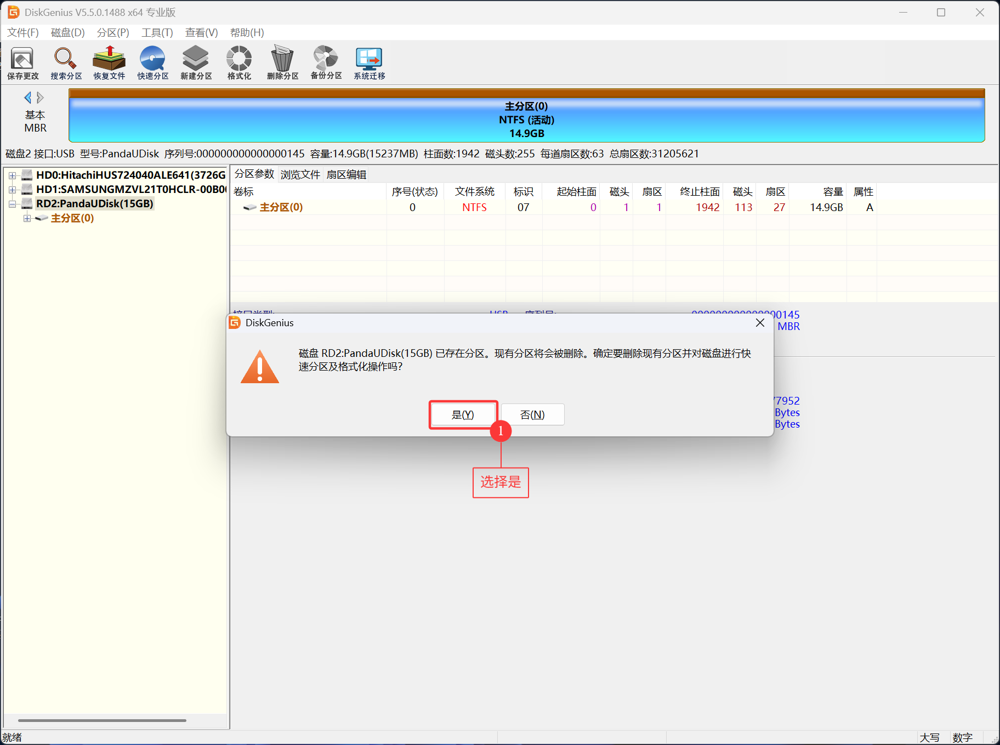

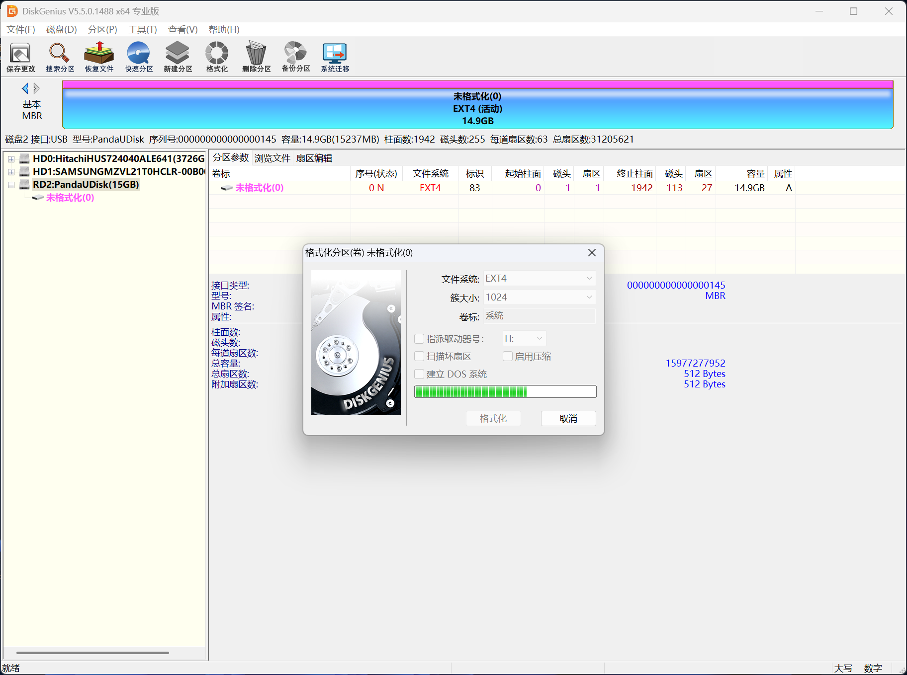

### 2.3、解压seekfree_2k300_Core_install_Udisk_buildroot.7z

解压seekfree_2k300_Core_install_Udisk_buildroot.7z文件，可以使用7-ZIP进行解压，也可以使用其他的压缩包进行解压。

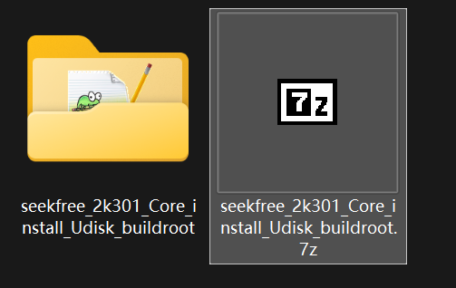

打开对应的路径。

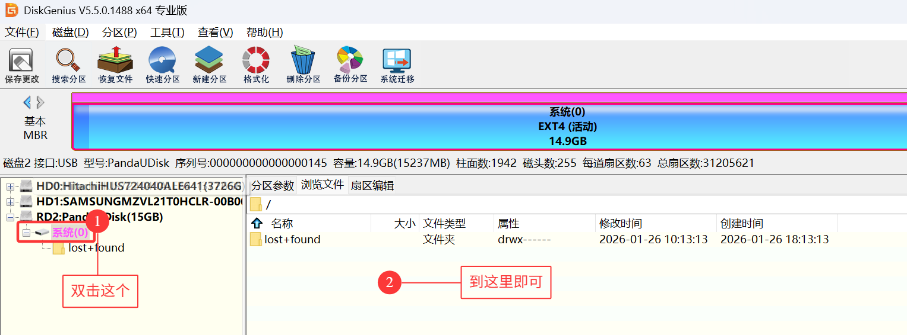

### 2.4、复制文件夹到U盘根目录

复制文件seekfree_2k300_Core_install_Udisk_buildroot文件夹里面的所有内容到U盘根目录下

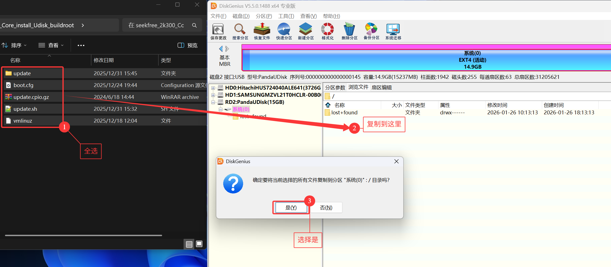

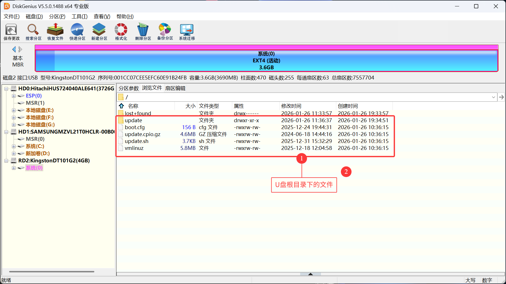

复制完成后，即可弹出U盘。

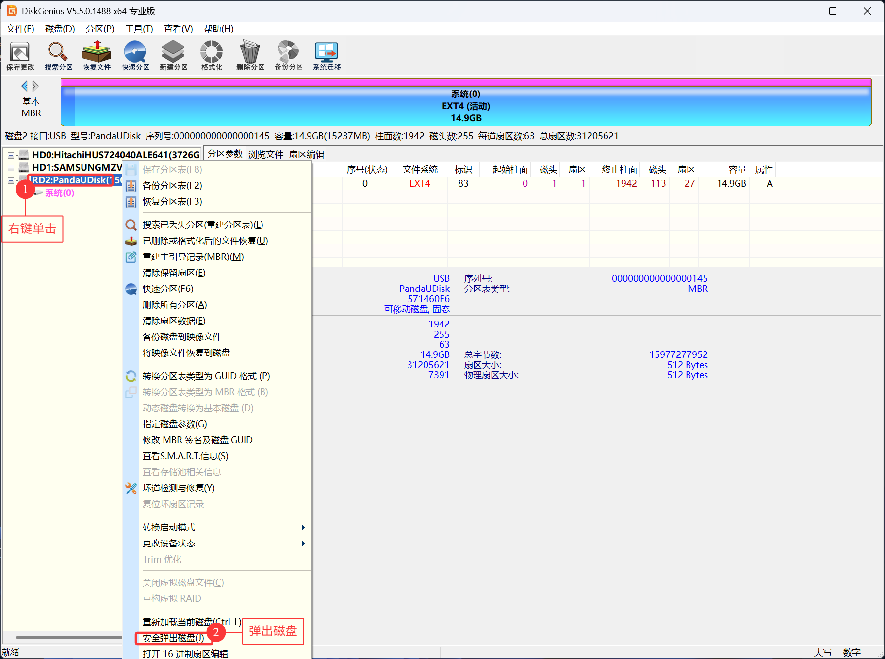

## 4、使用U盘刷入镜像

先插入U盘，**U盘只能需要使用Type-c接口的**，如果没有可以使用转换头把USB-A转化为Type-c接口。

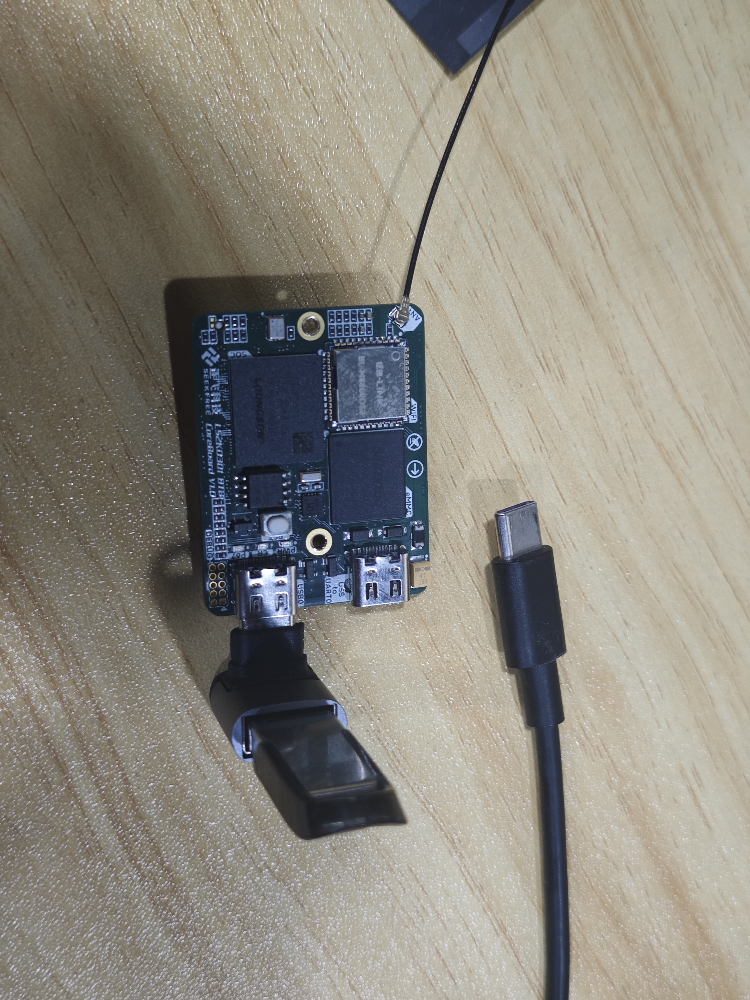

插上type-c与PC端进行连接

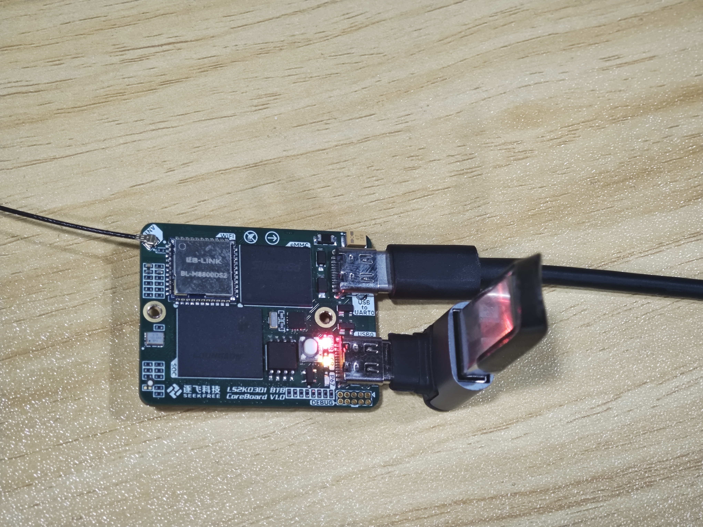

同时，我们通过串口打开终端，既可看到默认启动U盘更新系统选项

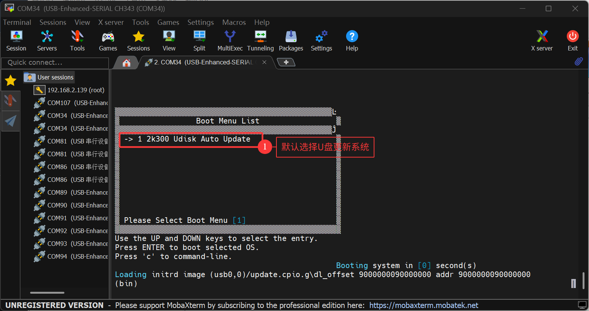

等待一段时间，出现这个页面即可说明U盘更新系统成功。

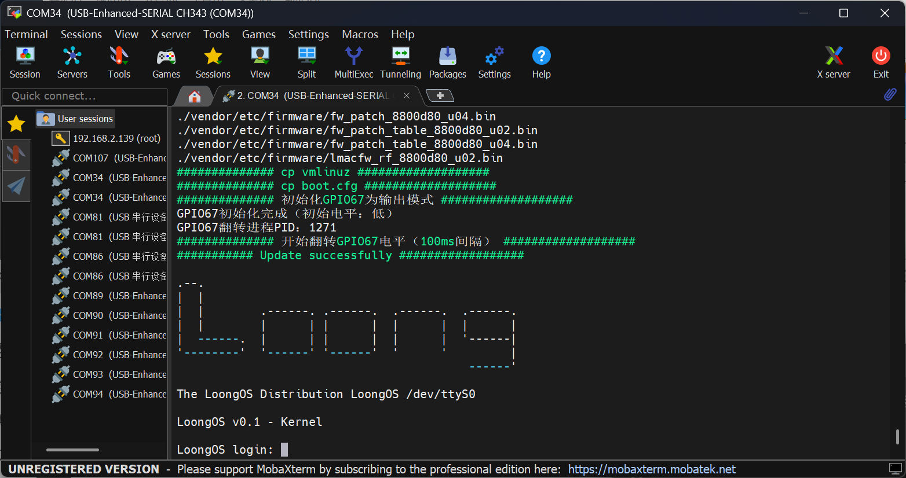

## 5、重启系统

拔掉U盘，断电或者按核心板上面的复位按键，即可重启。

